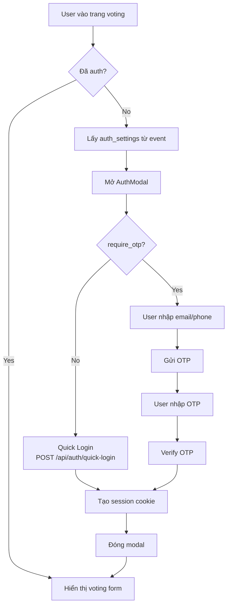

# GalaVote - DOCUMENTATION

> Hệ thống bình chọn sự kiện với authentication linh hoạt và realtime results

---

## 📚 MỤC LỤC TÀI LIỆU

### 1. **[description.md](./description.md)** - Mô tả Hệ thống
- Mục đích dự án
- Quy trình vận hành
- Sơ đồ luồng hoạt động
- Bảo mật và chống gian lận

### 2. **[implementation-plan.md](./implementation-plan.md)** - Kế hoạch Triển khai
- Timeline 15 ngày với 6 phases
- Chi tiết từng bước implementation
- Code examples cho mỗi phase
- Checklist hoàn thành
- **👉 BẮT ĐẦU TỪ ĐÂY khi implement**

### 3. **[tech-stack.md](./tech-stack.md)** - Tech Stack Chi tiết
- Frontend: Next.js 14, TypeScript, Tailwind CSS
- UI Library: shadcn/ui
- Backend: Supabase (PostgreSQL + Realtime + Auth)
- Deployment: Vercel
- So sánh alternatives

### 4. **[database-schema.md](./database-schema.md)** - Database Schema
- ERD diagram
- 6 tables: events, categories, candidates, voters, votes, otp_verifications
- Full SQL scripts
- Row Level Security (RLS) policies
- Views, functions, indexes
- TypeScript type generation

### 5. **[authentication-flow.md](./authentication-flow.md)** ⭐ **MỚI**
- **Modal-based authentication** (không redirect)
- **Flexible auth settings** configurable per event
- 4 authentication modes:
  - Quick (email only, no OTP)
  - Standard (email + phone, no OTP)
  - Secure (email + phone + OTP)
  - Phone only
- Implementation guide
- Code examples

### 6. **[api-specification.md](./api-specification.md)** - API Endpoints
- Authentication endpoints
  - `/api/auth/quick-login` - Login nhanh không OTP
  - `/api/auth/send-otp` - Gửi OTP
  - `/api/auth/verify-otp` - Xác thực OTP
- Voting endpoints
- Public data endpoints
- Admin endpoints
- Error handling & rate limiting

### 7. **[ui-components.md](./ui-components.md)** - UI Components
- Design system (colors, typography)
- Page components
- **AuthModal** component (modal login)
- Feature components (CategoryCard, CandidateCard, OTPInput)
- Layout components
- shadcn/ui components list

### 8. **[pages-specification.md](./pages-specification.md)** ⭐ **MỚI**
- **Chi tiết tất cả pages** (Public + Admin)
- Landing Page, Voting Page, Results Page
- Admin Dashboard, Event Settings, Categories, Candidates, Voters
- **Multiple votes per category** logic
- **Edit vote** feature
- Navigation & routing

### 9. **[deployment-guide.md](./deployment-guide.md)** - Deployment Guide
- Pre-deployment checklist
- Supabase setup (production)
- Vercel deployment
- Environment variables
- Custom domain & DNS
- QR code generation
- Monitoring & troubleshooting

---

## 🚀 QUICK START

### Bước 1: Đọc tài liệu cơ bản
1. [description.md](./description.md) - Hiểu hệ thống
2. [tech-stack.md](./tech-stack.md) - Biết công nghệ dùng gì
3. **[authentication-flow.md](./authentication-flow.md)** - Hiểu flow auth mới

### Bước 2: Setup môi trường
1. Clone repository
2. Đọc [implementation-plan.md](./implementation-plan.md) Phase 1
3. Follow từng bước

### Bước 3: Implement theo plan
- Follow [implementation-plan.md](./implementation-plan.md) từ Phase 1 → Phase 6
- Tham khảo các docs khác khi cần

### Bước 4: Deploy
- Follow [deployment-guide.md](./deployment-guide.md)

---

## ⭐ TÍNH NĂNG NỔI BẬT

### 1. Modal-based Authentication
- **Không redirect**: User ở ngay trang voting, modal popup để auth
- **Flexible**: Admin config authentication requirements
- **Progressive**: Chỉ hỏi thông tin cần thiết
- **Seamless UX**: Voter vote ngay sau khi auth

### 2. Flexible Auth Settings (Configurable per Event)
```json
{
  "require_email": true,    // Yêu cầu email?
  "require_phone": true,    // Yêu cầu phone?
  "require_otp": true,      // Yêu cầu OTP?
  "otp_method": "email"     // Gửi OTP qua email/sms
}
```

**Admin có thể chọn:**
- ✅ Chỉ email, không OTP (nhanh nhất)
- ✅ Email + phone, không OTP
- ✅ Email + phone + OTP (secure nhất)
- ✅ Chỉ phone, không OTP

### 3. Realtime Results
- WebSocket subscriptions (Supabase Realtime)
- Auto-update khi có vote mới
- Live indicator

### 4. Mobile-first Design
- Responsive trên mọi devices
- QR code scanning support
- Touch-friendly UI

---

## 📁 FOLDER STRUCTURE

```
event-voting/
├── docs/                           # 📚 TẤT CẢ TÀI LIỆU Ở ĐÂY
│   ├── README.md                   # ⭐ Bạn đang đọc file này
│   ├── description.md              # Mô tả hệ thống
│   ├── implementation-plan.md      # 👉 Kế hoạch chi tiết
│   ├── tech-stack.md               # Công nghệ
│   ├── database-schema.md          # Database
│   ├── authentication-flow.md      # ⭐ Auth flow (MODAL-BASED)
│   ├── api-specification.md        # API endpoints
│   ├── ui-components.md            # UI components
│   └── deployment-guide.md         # Deploy
├── app/                            # Next.js app
│   ├── (voting)/
│   │   ├── page.tsx                # Landing/Voting page (main)
│   │   ├── results/page.tsx        # Results page
│   │   └── layout.tsx
│   ├── admin/                      # Admin dashboard
│   │   ├── page.tsx
│   │   ├── events/page.tsx
│   │   ├── categories/page.tsx
│   │   └── candidates/page.tsx
│   ├── api/                        # API routes
│   │   ├── auth/
│   │   │   ├── quick-login/route.ts   # ⭐ Quick login (no OTP)
│   │   │   ├── send-otp/route.ts
│   │   │   └── verify-otp/route.ts
│   │   ├── votes/route.ts
│   │   └── events/active/route.ts
│   └── layout.tsx
├── components/
│   ├── ui/                         # shadcn/ui components
│   ├── auth/
│   │   ├── AuthModal.tsx           # ⭐ Modal login (MAIN AUTH UI)
│   │   └── OTPInput.tsx
│   ├── voting/
│   │   ├── CategoryCard.tsx
│   │   ├── CandidateCard.tsx
│   │   └── VotingForm.tsx
│   └── results/
│       └── ResultsChart.tsx
├── lib/
│   ├── supabase/
│   │   ├── client.ts
│   │   └── server.ts
│   ├── validations.ts              # ⭐ Dynamic validation theo settings
│   └── utils.ts
├── types/
│   └── database.types.ts           # Generated from Supabase
└── .env.local                      # Environment variables
```

---

## 🔑 KEY CONCEPTS

### Authentication Flow (MODAL-BASED)



### Database Relationships

```
events (1) ──→ (N) categories (1) ──→ (N) candidates
                                  ↓
                                (N) votes
                                  ↓
voters (1) ──────────────────→ (N) votes
       (1) ──→ (N) otp_verifications
```

---

## 🛠️ TECH STACK SUMMARY

| Layer | Technology | Why? |
|-------|-----------|------|
| **Framework** | Next.js 14 (App Router) | Full-stack, SSR, optimal DX |
| **Language** | TypeScript | Type safety, better IDE support |
| **Styling** | Tailwind CSS | Utility-first, rapid development |
| **UI Library** | shadcn/ui | Beautiful, accessible, customizable |
| **Database** | Supabase (PostgreSQL) | Realtime, Auth, Storage built-in |
| **Auth** | Cookie-based sessions | Secure, HTTPOnly, XSS-safe |
| **Email** | Supabase Auth Email | Built-in, simple for MVP |
| **Deployment** | Vercel | Zero-config Next.js, global CDN |

---

## 📊 AUTHENTICATION MODES

| Mode | Config | Use Case | UX |
|------|--------|----------|-----|
| **Quick** | `{email: true, phone: false, otp: false}` | Internal events, trusted users | ⚡ Fastest (1 step) |
| **Standard** | `{email: true, phone: true, otp: false}` | Company events, need contact | 🔷 Medium (1 step) |
| **Secure** | `{email: true, phone: true, otp: true}` | Public events, need verification | 🔐 Secure (2 steps) |
| **Phone Only** | `{email: false, phone: true, otp: false}` | Simple tracking | ⚡ Fast (1 step) |

**Admin configures this in event settings!**

---

## ✅ IMPLEMENTATION CHECKLIST

### Phase 1: Foundation ✅
- [ ] Next.js project setup
- [ ] Supabase project created
- [ ] Database schema deployed (với `auth_settings` column)
- [ ] shadcn/ui installed

### Phase 2: Authentication ✅
- [ ] AuthModal component (modal-based)
- [ ] Quick login API (`/api/auth/quick-login`)
- [ ] OTP APIs (modified to use settings)
- [ ] Dynamic validation schema

### Phase 3: Voting ✅
- [ ] Voting page with modal auth
- [ ] CategoryCard, CandidateCard
- [ ] Submit votes API

### Phase 4: Realtime ✅
- [ ] Results page
- [ ] Realtime subscriptions
- [ ] Live updates

### Phase 5: Admin ✅
- [ ] Admin dashboard
- [ ] Event auth settings config UI
- [ ] CRUD operations

### Phase 6: Deployment ✅
- [ ] Environment variables
- [ ] Deploy to Vercel
- [ ] QR code generation
- [ ] Production testing

---

## 🔗 IMPORTANT LINKS

### Documentation
- [Next.js Docs](https://nextjs.org/docs)
- [Supabase Docs](https://supabase.com/docs)
- [shadcn/ui Docs](https://ui.shadcn.com)
- [Tailwind CSS Docs](https://tailwindcss.com/docs)

### Tools
- [Supabase Dashboard](https://supabase.com/dashboard)
- [Vercel Dashboard](https://vercel.com/dashboard)
- [QR Code Generator](https://www.qr-code-generator.com/)

---

## 💡 TIPS & BEST PRACTICES

### Development
1. **Always read event settings first** before rendering auth UI
2. **Use dynamic validation** based on `auth_settings`
3. **Test all auth modes** (quick, standard, secure, phone-only)
4. **Modal should not close** on outside click during auth

### Security
1. **HTTPOnly cookies** for sessions
2. **Row Level Security (RLS)** for all tables
3. **Input validation** with Zod on both client & server
4. **Rate limiting** on OTP requests (3/hour)

### UX
1. **Show loading states** during API calls
2. **Clear error messages** in Vietnamese
3. **Auto-focus** next input in OTP
4. **Paste support** for OTP (6 digits)

### Performance
1. **Server Components** for data fetching
2. **Client Components** only when needed (modal, forms)
3. **Optimize images** with Next.js Image
4. **Database indexes** on foreign keys

---

## 🎯 NEXT STEPS

1. ✅ Đọc [authentication-flow.md](./authentication-flow.md) để hiểu flow mới
2. ✅ Đọc [implementation-plan.md](./implementation-plan.md)
3. ✅ Setup project theo Phase 1
4. ✅ Implement auth modal theo Phase 2
5. ✅ Continue với các phases tiếp theo

---

## 📞 SUPPORT

Nếu có thắc mắc về implementation:
1. Đọc lại docs liên quan
2. Check code examples trong docs
3. Review [authentication-flow.md](./authentication-flow.md) section 6

---

**Last updated**: 2025-11-05
**Version**: 2.0 (Modal-based auth với flexible settings)
**Status**: Ready for implementation ✅
