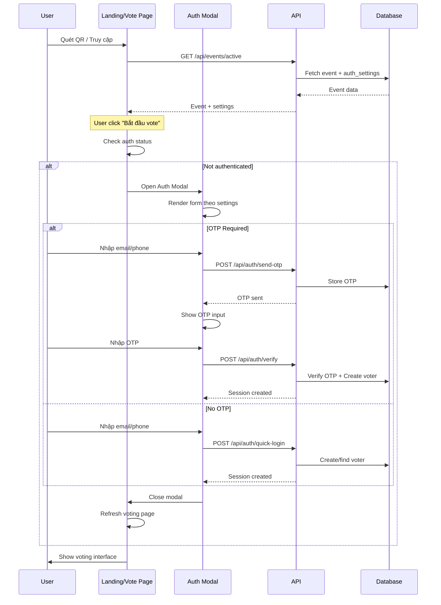
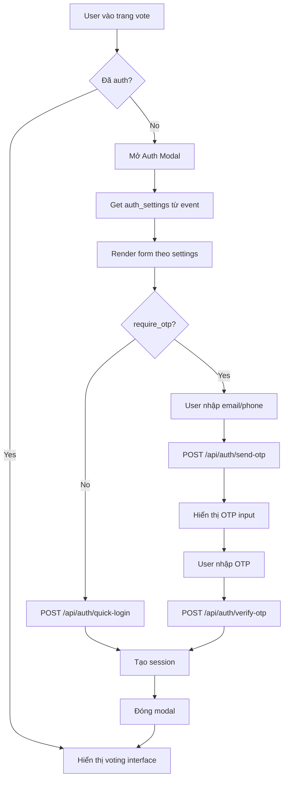

# AUTHENTICATION FLOW - MODAL-BASED & FLEXIBLE CONFIG

> Hệ thống authentication linh hoạt với Modal UI và cấu hình động từ event settings

---

## 📋 MỤC LỤC

1. [Overview](#1-overview)
2. [Authentication Settings](#2-authentication-settings)
3. [Modal-based Flow](#3-modal-based-flow)
4. [API Endpoints](#4-api-endpoints)
5. [UI Components](#5-ui-components)
6. [Implementation Guide](#6-implementation-guide)

---

## 1. OVERVIEW

### Nguyên tắc thiết kế
- ✅ **Modal-based**: Không redirect sang page khác, dùng Dialog/Modal
- ✅ **Flexible Auth**: Admin config trong event settings
- ✅ **Seamless UX**: Voter vote ngay sau khi auth, không bị gián đoạn
- ✅ **Progressive**: Chỉ hỏi thông tin cần thiết theo config

### Authentication Modes

| Mode | Email | Phone | OTP | Use Case |
|------|-------|-------|-----|----------|
| **Quick** | ✅ | ❌ | ❌ | Sự kiện nội bộ, tin tưởng |
| **Standard** | ✅ | ✅ | ❌ | Sự kiện công ty, cần contact info |
| **Secure** | ✅ | ✅ | ✅ | Sự kiện public, cần xác thực |
| **Phone Only** | ❌ | ✅ | ❌ | Event đơn giản, chỉ track phone |

---

## 2. AUTHENTICATION SETTINGS

### 2.1. Database Schema

```sql
-- Table: events
CREATE TABLE events (
    -- ... other fields
    auth_settings JSONB DEFAULT '{"require_email": true, "require_phone": true, "require_otp": true}'::jsonb,
    -- ...
);
```

### 2.2. Settings Structure

```typescript
interface AuthSettings {
  require_email: boolean      // Bắt buộc nhập email
  require_phone: boolean      // Bắt buộc nhập phone
  require_otp: boolean        // Bắt buộc xác thực OTP (gửi qua email nếu có, hoặc phone)
  otp_method?: 'email' | 'sms' // Phương thức gửi OTP (default: email)
}
```

### 2.3. Validation Logic

```typescript
// lib/validations.ts
import { z } from 'zod'

export function createAuthSchema(settings: AuthSettings) {
  const schema: any = {}

  if (settings.require_email) {
    schema.email = z.string().email('Email không hợp lệ')
  }

  if (settings.require_phone) {
    schema.phone = z.string()
      .min(10, 'Số điện thoại phải có ít nhất 10 số')
      .max(11, 'Số điện thoại tối đa 11 số')
      .regex(/^\d+$/, 'Số điện thoại chỉ chứa chữ số')
  }

  return z.object(schema)
}

export const otpSchema = z.object({
  otp: z.string().length(6, 'OTP phải có 6 chữ số'),
})
```

### 2.4. Admin Configuration UI

```typescript
// Admin page để config auth settings
interface EventAuthConfigProps {
  eventId: string
  currentSettings: AuthSettings
}

function EventAuthConfig({ eventId, currentSettings }: EventAuthConfigProps) {
  const [settings, setSettings] = useState(currentSettings)

  return (
    <Card>
      <CardHeader>
        <CardTitle>Cấu hình Xác thực</CardTitle>
        <CardDescription>
          Chọn thông tin cần thiết để người dùng vote
        </CardDescription>
      </CardHeader>
      <CardContent className="space-y-4">
        <div className="flex items-center justify-between">
          <Label>Yêu cầu Email</Label>
          <Switch
            checked={settings.require_email}
            onCheckedChange={(checked) =>
              setSettings({ ...settings, require_email: checked })
            }
          />
        </div>

        <div className="flex items-center justify-between">
          <Label>Yêu cầu Số điện thoại</Label>
          <Switch
            checked={settings.require_phone}
            onCheckedChange={(checked) =>
              setSettings({ ...settings, require_phone: checked })
            }
          />
        </div>

        <div className="flex items-center justify-between">
          <Label>Xác thực OTP</Label>
          <Switch
            checked={settings.require_otp}
            onCheckedChange={(checked) =>
              setSettings({ ...settings, require_otp: checked })
            }
            disabled={!settings.require_email && !settings.require_phone}
          />
        </div>

        {settings.require_otp && (
          <div className="pl-6 space-y-2">
            <Label>Gửi OTP qua</Label>
            <RadioGroup
              value={settings.otp_method || 'email'}
              onValueChange={(value) =>
                setSettings({ ...settings, otp_method: value as 'email' | 'sms' })
              }
            >
              {settings.require_email && (
                <div className="flex items-center space-x-2">
                  <RadioGroupItem value="email" id="email" />
                  <Label htmlFor="email">Email</Label>
                </div>
              )}
              {settings.require_phone && (
                <div className="flex items-center space-x-2">
                  <RadioGroupItem value="sms" id="sms" />
                  <Label htmlFor="sms">SMS (Phone)</Label>
                </div>
              )}
            </RadioGroup>
          </div>
        )}

        <Button onClick={() => saveSettings(eventId, settings)}>
          Lưu cấu hình
        </Button>
      </CardContent>
    </Card>
  )
}
```

---

## 3. MODAL-BASED FLOW

### 3.1. User Journey



### 3.2. Modal States

```typescript
type AuthModalState =
  | 'closed'           // Modal đóng
  | 'input'            // Đang nhập email/phone
  | 'otp'              // Đang nhập OTP (nếu require_otp = true)
  | 'loading'          // Đang xử lý
  | 'success'          // Thành công

interface AuthModalProps {
  isOpen: boolean
  onClose: () => void
  authSettings: AuthSettings
  onSuccess: () => void
}
```

### 3.3. Flow Chart



---

## 4. API ENDPOINTS

### 4.1. Get Event Settings

**Endpoint**: `GET /api/events/active`

**Response**:
```json
{
  "success": true,
  "data": {
    "event": {
      "id": "uuid",
      "name": "Event name",
      "auth_settings": {
        "require_email": true,
        "require_phone": true,
        "require_otp": true,
        "otp_method": "email"
      },
      "is_voting_open": true,
      "categories": [...]
    }
  }
}
```

### 4.2. Quick Login (No OTP)

**Endpoint**: `POST /api/auth/quick-login`

**Request**:
```json
{
  "email": "user@example.com",     // required if require_email = true
  "phone": "0901234567"             // required if require_phone = true
}
```

**Response**:
```json
{
  "success": true,
  "data": {
    "voter": {
      "id": "uuid",
      "email": "user@example.com",
      "phone": "0901234567"
    }
  }
}
```

**Implementation**:
```typescript
// app/api/auth/quick-login/route.ts
import { NextRequest, NextResponse } from 'next/server'
import { createClient } from '@/lib/supabase/server'
import { cookies } from 'next/headers'

export async function POST(request: NextRequest) {
  try {
    const { email, phone } = await request.json()
    const supabase = createClient()

    // Get event settings to validate required fields
    const { data: event } = await supabase
      .from('events')
      .select('auth_settings')
      .eq('is_active', true)
      .single()

    if (!event) {
      return NextResponse.json(
        { success: false, error: 'No active event' },
        { status: 404 }
      )
    }

    const settings = event.auth_settings

    // Validate required fields
    if (settings.require_email && !email) {
      return NextResponse.json(
        { success: false, error: 'Email is required' },
        { status: 400 }
      )
    }

    if (settings.require_phone && !phone) {
      return NextResponse.json(
        { success: false, error: 'Phone is required' },
        { status: 400 }
      )
    }

    // Check if OTP is required
    if (settings.require_otp) {
      return NextResponse.json(
        { success: false, error: 'OTP verification is required' },
        { status: 400 }
      )
    }

    // Create or find voter
    const voterData: any = {}
    if (email) voterData.email = email
    if (phone) voterData.phone = phone
    voterData.verified_at = new Date().toISOString()

    const { data: voter, error: voterError } = await supabase
      .from('voters')
      .upsert(voterData, {
        onConflict: email ? 'email' : undefined
      })
      .select()
      .single()

    if (voterError) throw voterError

    // Set session cookie
    cookies().set('voter_id', voter.id, {
      httpOnly: true,
      secure: process.env.NODE_ENV === 'production',
      sameSite: 'lax',
      maxAge: 60 * 60 * 24, // 24 hours
      path: '/',
    })

    return NextResponse.json({
      success: true,
      data: { voter },
    })
  } catch (error) {
    console.error('Quick login error:', error)
    return NextResponse.json(
      { success: false, error: 'Login failed' },
      { status: 500 }
    )
  }
}
```

### 4.3. Send OTP (Modified)

**Endpoint**: `POST /api/auth/send-otp`

**Request**:
```json
{
  "email": "user@example.com",
  "phone": "0901234567"
}
```

**Logic**: Dựa vào `auth_settings.otp_method` để gửi OTP qua email hoặc SMS.

### 4.4. Verify OTP (Modified)

**Endpoint**: `POST /api/auth/verify-otp`

**Request**:
```json
{
  "email": "user@example.com",  // hoặc phone
  "phone": "0901234567",
  "otp": "123456"
}
```

---

## 5. UI COMPONENTS

### 5.1. AuthModal Component

```typescript
// home/auth/AuthModal.tsx
'use client'

import { useState, useEffect } from 'react'
import {
  Dialog,
  DialogContent,
  DialogDescription,
  DialogHeader,
  DialogTitle,
} from '@/home/ui/dialog'
import { Button } from '@/home/ui/button'
import { Input } from '@/home/ui/input'
import { Label } from '@/home/ui/label'
import { useForm } from 'react-hook-form'
import { zodResolver } from '@hookform/resolvers/zod'
import { createAuthSchema } from '@/lib/validations'
import { toast } from 'sonner'
import OTPInput from './OTPInput'
import { Loader2 } from 'lucide-react'

interface AuthModalProps {
  isOpen: boolean
  onClose: () => void
  authSettings: AuthSettings
  onSuccess: () => void
}

export default function AuthModal({
  isOpen,
  onClose,
  authSettings,
  onSuccess,
}: AuthModalProps) {
  const [state, setState] = useState<AuthModalState>('input')
  const [userInfo, setUserInfo] = useState<{ email?: string; phone?: string }>({})
  const [otp, setOtp] = useState('')

  const schema = createAuthSchema(authSettings)
  const form = useForm({
    resolver: zodResolver(schema),
  })

  async function handleSubmit(data: any) {
    setUserInfo(data)

    if (authSettings.require_otp) {
      // Send OTP
      setState('loading')
      try {
        const response = await fetch('/api/auth/send-otp', {
          method: 'POST',
          headers: { 'Content-Type': 'application/json' },
          body: JSON.stringify(data),
        })

        const result = await response.json()

        if (!response.ok) {
          toast.error(result.error)
          setState('input')
          return
        }

        toast.success('OTP đã được gửi!')
        setState('otp')
      } catch (error) {
        toast.error('Có lỗi xảy ra, vui lòng thử lại')
        setState('input')
      }
    } else {
      // Quick login without OTP
      setState('loading')
      try {
        const response = await fetch('/api/auth/quick-login', {
          method: 'POST',
          headers: { 'Content-Type': 'application/json' },
          body: JSON.stringify(data),
        })

        const result = await response.json()

        if (!response.ok) {
          toast.error(result.error)
          setState('input')
          return
        }

        setState('success')
        toast.success('Đăng nhập thành công!')
        onSuccess()
        onClose()
      } catch (error) {
        toast.error('Có lỗi xảy ra, vui lòng thử lại')
        setState('input')
      }
    }
  }

  async function handleVerifyOTP() {
    if (otp.length !== 6) {
      toast.error('Vui lòng nhập đủ 6 chữ số')
      return
    }

    setState('loading')
    try {
      const response = await fetch('/api/auth/verify-otp', {
        method: 'POST',
        headers: { 'Content-Type': 'application/json' },
        body: JSON.stringify({ ...userInfo, otp }),
      })

      const result = await response.json()

      if (!response.ok) {
        toast.error(result.error)
        setState('otp')
        setOtp('')
        return
      }

      setState('success')
      toast.success('Xác thực thành công!')
      onSuccess()
      onClose()
    } catch (error) {
      toast.error('Có lỗi xảy ra, vui lòng thử lại')
      setState('otp')
      setOtp('')
    }
  }

  return (
    <Dialog open={isOpen} onOpenChange={onClose}>
      <DialogContent className="sm:max-w-md">
        <DialogHeader>
          <DialogTitle>
            {state === 'otp' ? 'Nhập mã OTP' : 'Đăng nhập để bình chọn'}
          </DialogTitle>
          <DialogDescription>
            {state === 'otp'
              ? `Mã OTP đã được gửi đến ${authSettings.otp_method === 'email' ? 'email' : 'số điện thoại'} của bạn`
              : 'Vui lòng nhập thông tin để tiếp tục'}
          </DialogDescription>
        </DialogHeader>

        {state === 'input' && (
          <form onSubmit={form.handleSubmit(handleSubmit)} className="space-y-4">
            {authSettings.require_email && (
              <div className="space-y-2">
                <Label htmlFor="email">Email</Label>
                <Input
                  id="email"
                  type="email"
                  placeholder="email@example.com"
                  {...form.register('email')}
                />
                {form.formState.errors.email && (
                  <p className="text-sm text-destructive">
                    {form.formState.errors.email.message as string}
                  </p>
                )}
              </div>
            )}

            {authSettings.require_phone && (
              <div className="space-y-2">
                <Label htmlFor="phone">Số điện thoại</Label>
                <Input
                  id="phone"
                  type="tel"
                  placeholder="0901234567"
                  {...form.register('phone')}
                />
                {form.formState.errors.phone && (
                  <p className="text-sm text-destructive">
                    {form.formState.errors.phone.message as string}
                  </p>
                )}
              </div>
            )}

            <Button type="submit" className="w-full">
              {authSettings.require_otp ? 'Gửi mã OTP' : 'Đăng nhập'}
            </Button>
          </form>
        )}

        {state === 'otp' && (
          <div className="space-y-6">
            <OTPInput value={otp} onChange={setOtp} length={6} />

            <Button onClick={handleVerifyOTP} className="w-full">
              Xác nhận
            </Button>

            <Button
              variant="ghost"
              className="w-full"
              onClick={() => {
                setState('input')
                setOtp('')
              }}
            >
              Quay lại
            </Button>
          </div>
        )}

        {state === 'loading' && (
          <div className="flex justify-center py-8">
            <Loader2 className="w-8 h-8 animate-spin" />
          </div>
        )}
      </DialogContent>
    </Dialog>
  )
}
```

### 5.2. Integration in Voting Page

```typescript
// app/page.tsx or app/vote/page.tsx
'use client'

import { useState, useEffect } from 'react'
import { createClient } from '@/lib/supabase/client'
import AuthModal from '@/home/auth/AuthModal'
import { Button } from '@/home/ui/button'

export default function VotingPage() {
  const [event, setEvent] = useState<any>(null)
  const [isAuthModalOpen, setIsAuthModalOpen] = useState(false)
  const [isAuthenticated, setIsAuthenticated] = useState(false)

  useEffect(() => {
    fetchEvent()
    checkAuth()
  }, [])

  async function fetchEvent() {
    const response = await fetch('/api/events/active')
    const data = await response.json()
    if (data.success) {
      setEvent(data.data.event)
    }
  }

  async function checkAuth() {
    // Check if voter_id cookie exists
    const hasSession = document.cookie.includes('voter_id')
    setIsAuthenticated(hasSession)
  }

  function handleStartVoting() {
    if (!isAuthenticated) {
      setIsAuthModalOpen(true)
    }
  }

  if (!event) return <div>Loading...</div>

  return (
    <div className="container py-10">
      <h1 className="text-4xl font-bold mb-8">{event.name}</h1>

      {!isAuthenticated ? (
        <div className="text-center py-20">
          <p className="text-xl mb-6">
            Vui lòng đăng nhập để bắt đầu bình chọn
          </p>
          <Button size="lg" onClick={handleStartVoting}>
            Bắt đầu bình chọn
          </Button>
        </div>
      ) : (
        <div>
          {/* Voting interface here */}
          <VotingForm categories={event.categories} />
        </div>
      )}

      {event.auth_settings && (
        <AuthModal
          isOpen={isAuthModalOpen}
          onClose={() => setIsAuthModalOpen(false)}
          authSettings={event.auth_settings}
          onSuccess={() => {
            setIsAuthenticated(true)
            checkAuth()
          }}
        />
      )}
    </div>
  )
}
```

---

## 6. IMPLEMENTATION GUIDE

### Phase 1: Update Database
1. Add `auth_settings` column to `events` table
2. Set default value
3. Migrate existing events

### Phase 2: Create Quick Login API
1. Implement `/api/auth/quick-login` endpoint
2. Validate based on event settings
3. Create voter without OTP

### Phase 3: Modify OTP APIs
1. Update `/api/auth/send-otp` to check settings
2. Update `/api/auth/verify-otp` to support both email/phone

### Phase 4: Build AuthModal
1. Create dynamic form based on settings
2. Implement state machine (input → otp → success)
3. Add loading states

### Phase 5: Integrate
1. Add AuthModal to voting page
2. Check auth before showing voting form
3. Test all auth modes

### Phase 6: Admin UI
1. Build settings config page
2. Add to admin dashboard
3. Test different configurations

---

## ✅ CHECKLIST

### Database ✅
- [ ] Add `auth_settings` column
- [ ] Set default value
- [ ] Add validation constraints

### API ✅
- [ ] Implement quick-login endpoint
- [ ] Modify send-otp to use settings
- [ ] Modify verify-otp to use settings
- [ ] Add settings to event response

### UI ✅
- [ ] Create AuthModal component
- [ ] Create dynamic form builder
- [ ] Add OTP input
- [ ] Handle all states

### Integration ✅
- [ ] Add modal to voting page
- [ ] Check auth status
- [ ] Handle success callback

### Admin ✅
- [ ] Build config UI
- [ ] Add to dashboard
- [ ] Test all modes

---

**Last updated**: 2025-11-05
**Status**: Ready for implementation ✅
