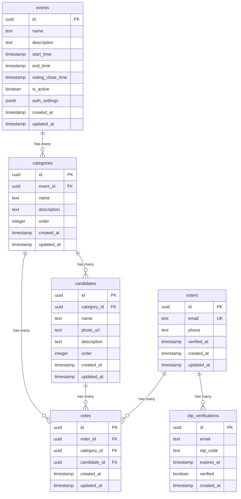

# DATABASE SCHEMA - EVENT VOTING SYSTEM

> Chi tiết về cấu trúc database, SQL scripts, relationships và RLS policies

---

## 📋 MỤC LỤC

1. [Overview](#1-overview)
2. [Entity Relationship Diagram](#2-entity-relationship-diagram)
3. [Table Schemas](#3-table-schemas)
4. [SQL Scripts](#4-sql-scripts)
5. [Row Level Security Policies](#5-row-level-security-policies)
6. [Database Functions](#6-database-functions)
7. [Database Views](#7-database-views)
8. [Indexes](#8-indexes)

---

## 1. OVERVIEW

### Database Information
- **Platform**: Supabase (PostgreSQL 15)
- **Total Tables**: 6
- **Features Used**:
  - Row Level Security (RLS)
  - Foreign Keys with Cascade
  - Triggers (auto-update timestamps)
  - Views (aggregated results)
  - Functions (business logic)
  - Unique Constraints (prevent duplicate votes)

### Tables Summary
| Table | Purpose | Key Features |
|-------|---------|--------------|
| `events` | Sự kiện voting | Active status, voting deadline, auth settings |
| `categories` | Danh hiệu (King, Queen) | Ordered list, belongs to event |
| `candidates` | Ứng viên | Photo URL, belongs to category |
| `voters` | Người tham gia voting | Email/phone-based auth, verified status |
| `votes` | Phiếu bầu | Unique per voter+category |
| `otp_verifications` | OTP codes (optional) | Expiry time, verified status |

---

## 2. ENTITY RELATIONSHIP DIAGRAM



---

## 3. TABLE SCHEMAS

### 3.1. Table: `events`
Lưu thông tin sự kiện voting

```sql
CREATE TABLE events (
    id UUID PRIMARY KEY DEFAULT gen_random_uuid(),
    name TEXT NOT NULL,
    description TEXT,
    start_time TIMESTAMP WITH TIME ZONE NOT NULL,
    end_time TIMESTAMP WITH TIME ZONE NOT NULL,
    voting_close_time TIMESTAMP WITH TIME ZONE NOT NULL,
    is_active BOOLEAN DEFAULT false,
    auth_settings JSONB DEFAULT '{"require_email": true, "require_phone": true, "require_otp": true}'::jsonb,
    max_votes_per_voter INTEGER DEFAULT 1,
    allow_edit_before_deadline BOOLEAN DEFAULT true,
    created_at TIMESTAMP WITH TIME ZONE DEFAULT NOW(),
    updated_at TIMESTAMP WITH TIME ZONE DEFAULT NOW()
);

-- Constraints
ALTER TABLE events
    ADD CONSTRAINT voting_close_before_end
    CHECK (voting_close_time <= end_time);

ALTER TABLE events
    ADD CONSTRAINT start_before_end
    CHECK (start_time < end_time);

-- Comments
COMMENT ON TABLE events IS 'Stores event information for voting';
COMMENT ON COLUMN events.is_active IS 'Only one event should be active at a time';
COMMENT ON COLUMN events.voting_close_time IS 'Voting will be locked after this time';
COMMENT ON COLUMN events.auth_settings IS 'Authentication configuration: require_email, require_phone, require_otp';
COMMENT ON COLUMN events.max_votes_per_voter IS 'Maximum number of candidates each voter can vote for (per category or total)';
COMMENT ON COLUMN events.allow_edit_before_deadline IS 'Allow voters to edit their votes before voting_close_time';
```

**Fields:**
- `id`: UUID primary key
- `name`: Tên sự kiện (e.g., "King & Queen of the Night 2025")
- `description`: Mô tả sự kiện
- `start_time`: Thời gian bắt đầu sự kiện
- `end_time`: Thời gian kết thúc sự kiện
- `voting_close_time`: **Thời điểm đóng vote** (quan trọng!)
- `is_active`: Chỉ 1 event active tại 1 thời điểm
- `auth_settings`: **JSONB config cho authentication**
  - `require_email`: boolean - Yêu cầu email để vote
  - `require_phone`: boolean - Yêu cầu phone để vote
  - `require_otp`: boolean - Yêu cầu xác thực OTP (nếu true, sẽ gửi OTP qua email)
- `max_votes_per_voter`: **Số ứng viên tối đa mỗi voter có thể vote** (mặc định: 1)
  - Ví dụ: 10 ứng viên, mỗi người vote tối đa 3 người
  - Áp dụng cho MỖI category (không phải tổng)
- `allow_edit_before_deadline`: **Cho phép sửa vote trước deadline** (mặc định: true)
  - `true`: Voter có thể sửa phiếu bất cứ lúc nào trước `voting_close_time`
  - `false`: Voter chỉ vote 1 lần, không sửa được
- `created_at`, `updated_at`: Timestamps

**Auth Settings Examples:**
```json
// Chỉ cần email, không OTP (login nhanh nhất)
{"require_email": true, "require_phone": false, "require_otp": false}

// Cần email + phone, không OTP
{"require_email": true, "require_phone": true, "require_otp": false}

// Full authentication với OTP
{"require_email": true, "require_phone": true, "require_otp": true}

// Chỉ phone, không email, không OTP
{"require_email": false, "require_phone": true, "require_otp": false}
```

---

### 3.2. Table: `categories`
Danh hiệu cần bình chọn (King, Queen, Best Dress, etc.)

```sql
CREATE TABLE categories (
    id UUID PRIMARY KEY DEFAULT gen_random_uuid(),
    event_id UUID NOT NULL REFERENCES events(id) ON DELETE CASCADE,
    name TEXT NOT NULL,
    description TEXT,
    "order" INTEGER NOT NULL DEFAULT 0,
    created_at TIMESTAMP WITH TIME ZONE DEFAULT NOW(),
    updated_at TIMESTAMP WITH TIME ZONE DEFAULT NOW()
);

-- Indexes
CREATE INDEX idx_categories_event_id ON categories(event_id);
CREATE INDEX idx_categories_order ON categories("order");

-- Unique constraint: No duplicate category names per event
ALTER TABLE categories
    ADD CONSTRAINT unique_category_per_event
    UNIQUE (event_id, name);

-- Comments
COMMENT ON TABLE categories IS 'Award categories for each event';
COMMENT ON COLUMN categories."order" IS 'Display order (ascending)';
```

**Fields:**
- `event_id`: FK to events
- `name`: Tên danh hiệu (e.g., "King of the Night")
- `order`: Thứ tự hiển thị (1, 2, 3...)

---

### 3.3. Table: `candidates`
Ứng viên cho từng danh hiệu

```sql
CREATE TABLE candidates (
    id UUID PRIMARY KEY DEFAULT gen_random_uuid(),
    category_id UUID NOT NULL REFERENCES categories(id) ON DELETE CASCADE,
    name TEXT NOT NULL,
    photo_url TEXT,
    description TEXT,
    "order" INTEGER NOT NULL DEFAULT 0,
    created_at TIMESTAMP WITH TIME ZONE DEFAULT NOW(),
    updated_at TIMESTAMP WITH TIME ZONE DEFAULT NOW()
);

-- Indexes
CREATE INDEX idx_candidates_category_id ON candidates(category_id);
CREATE INDEX idx_candidates_order ON candidates("order");

-- Comments
COMMENT ON TABLE candidates IS 'Candidates competing in each category';
COMMENT ON COLUMN candidates.photo_url IS 'URL to candidate photo in Supabase Storage';
```

**Fields:**
- `category_id`: FK to categories
- `name`: Tên ứng viên
- `photo_url`: URL ảnh (từ Supabase Storage)
- `description`: Mô tả ngắn về ứng viên
- `order`: Thứ tự hiển thị

---

### 3.4. Table: `voters`
Người tham gia bình chọn

```sql
CREATE TABLE voters (
    id UUID PRIMARY KEY DEFAULT gen_random_uuid(),
    email TEXT NOT NULL UNIQUE,
    phone TEXT,
    verified_at TIMESTAMP WITH TIME ZONE,
    created_at TIMESTAMP WITH TIME ZONE DEFAULT NOW(),
    updated_at TIMESTAMP WITH TIME ZONE DEFAULT NOW()
);

-- Indexes
CREATE UNIQUE INDEX idx_voters_email ON voters(email);

-- Constraints
ALTER TABLE voters
    ADD CONSTRAINT email_format
    CHECK (email ~* '^[A-Za-z0-9._%+-]+@[A-Za-z0-9.-]+\.[A-Z|a-z]{2,}$');

-- Comments
COMMENT ON TABLE voters IS 'Registered voters who have verified via OTP';
COMMENT ON COLUMN voters.verified_at IS 'Timestamp when OTP was verified';
```

**Fields:**
- `email`: Email (unique, dùng để track voter)
- `phone`: Số điện thoại
- `verified_at`: Thời điểm xác thực OTP thành công

**Important:** Email là identifier chính, không dùng phone vì dễ fake.

---

### 3.5. Table: `votes`
Phiếu bầu (mỗi voter 1 vote/category)

```sql
CREATE TABLE votes (
    id UUID PRIMARY KEY DEFAULT gen_random_uuid(),
    voter_id UUID NOT NULL REFERENCES voters(id) ON DELETE CASCADE,
    category_id UUID NOT NULL REFERENCES categories(id) ON DELETE CASCADE,
    candidate_id UUID NOT NULL REFERENCES candidates(id) ON DELETE CASCADE,
    created_at TIMESTAMP WITH TIME ZONE DEFAULT NOW(),
    updated_at TIMESTAMP WITH TIME ZONE DEFAULT NOW(),

    -- Unique constraint: 1 voter can only vote once per category
    CONSTRAINT unique_vote_per_category UNIQUE (voter_id, category_id)
);

-- Indexes
CREATE INDEX idx_votes_voter_id ON votes(voter_id);
CREATE INDEX idx_votes_category_id ON votes(category_id);
CREATE INDEX idx_votes_candidate_id ON votes(candidate_id);
CREATE INDEX idx_votes_created_at ON votes(created_at DESC);

-- Constraint: Candidate must belong to the category being voted for
ALTER TABLE votes
    ADD CONSTRAINT candidate_belongs_to_category
    CHECK (
        EXISTS (
            SELECT 1 FROM candidates
            WHERE id = candidate_id
            AND category_id = votes.category_id
        )
    );

-- Comments
COMMENT ON TABLE votes IS 'Ballot submissions from voters';
COMMENT ON CONSTRAINT unique_vote_per_category ON votes IS 'Ensures each voter can only vote once per category';
```

**Fields:**
- `voter_id`: FK to voters
- `category_id`: FK to categories
- `candidate_id`: FK to candidates
- `created_at`: Thời điểm vote
- `updated_at`: Thời điểm sửa vote (nếu có)

**Key Constraint:**
- `UNIQUE (voter_id, category_id)` → Mỗi voter chỉ vote 1 lần/danh hiệu
- Upsert logic: `ON CONFLICT (voter_id, category_id) DO UPDATE`

---

### 3.6. Table: `otp_verifications`
Lưu OTP codes để xác thực

```sql
CREATE TABLE otp_verifications (
    id UUID PRIMARY KEY DEFAULT gen_random_uuid(),
    email TEXT NOT NULL,
    otp_code TEXT NOT NULL,
    expires_at TIMESTAMP WITH TIME ZONE NOT NULL,
    verified BOOLEAN DEFAULT false,
    created_at TIMESTAMP WITH TIME ZONE DEFAULT NOW()
);

-- Indexes
CREATE INDEX idx_otp_email ON otp_verifications(email);
CREATE INDEX idx_otp_expires_at ON otp_verifications(expires_at);
CREATE INDEX idx_otp_verified ON otp_verifications(verified);

-- Comments
COMMENT ON TABLE otp_verifications IS 'OTP codes for email verification';
COMMENT ON COLUMN otp_verifications.expires_at IS 'OTP expires after 10 minutes';
```

**Fields:**
- `email`: Email nhận OTP
- `otp_code`: 6-digit code
- `expires_at`: Hết hạn sau 10 phút
- `verified`: Đã xác thực chưa

**Cleanup:** Tự động xóa OTP cũ hơn 24 giờ (dùng cron job hoặc trigger)

---

## 4. SQL SCRIPTS

### 4.1. Full Schema Creation Script

```sql
-- =============================================
-- EVENT VOTING SYSTEM - DATABASE SCHEMA
-- Supabase (PostgreSQL 15)
-- =============================================

-- Enable UUID extension
CREATE EXTENSION IF NOT EXISTS "uuid-ossp";

-- =============================================
-- TABLE: events
-- =============================================
CREATE TABLE events (
    id UUID PRIMARY KEY DEFAULT gen_random_uuid(),
    name TEXT NOT NULL,
    description TEXT,
    start_time TIMESTAMP WITH TIME ZONE NOT NULL,
    end_time TIMESTAMP WITH TIME ZONE NOT NULL,
    voting_close_time TIMESTAMP WITH TIME ZONE NOT NULL,
    is_active BOOLEAN DEFAULT false,
    created_at TIMESTAMP WITH TIME ZONE DEFAULT NOW(),
    updated_at TIMESTAMP WITH TIME ZONE DEFAULT NOW(),

    CONSTRAINT voting_close_before_end CHECK (voting_close_time <= end_time),
    CONSTRAINT start_before_end CHECK (start_time < end_time)
);

COMMENT ON TABLE events IS 'Stores event information for voting';

-- =============================================
-- TABLE: categories
-- =============================================
CREATE TABLE categories (
    id UUID PRIMARY KEY DEFAULT gen_random_uuid(),
    event_id UUID NOT NULL REFERENCES events(id) ON DELETE CASCADE,
    name TEXT NOT NULL,
    description TEXT,
    "order" INTEGER NOT NULL DEFAULT 0,
    created_at TIMESTAMP WITH TIME ZONE DEFAULT NOW(),
    updated_at TIMESTAMP WITH TIME ZONE DEFAULT NOW(),

    CONSTRAINT unique_category_per_event UNIQUE (event_id, name)
);

CREATE INDEX idx_categories_event_id ON categories(event_id);
CREATE INDEX idx_categories_order ON categories("order");

COMMENT ON TABLE categories IS 'Award categories for each event';

-- =============================================
-- TABLE: candidates
-- =============================================
CREATE TABLE candidates (
    id UUID PRIMARY KEY DEFAULT gen_random_uuid(),
    category_id UUID NOT NULL REFERENCES categories(id) ON DELETE CASCADE,
    name TEXT NOT NULL,
    photo_url TEXT,
    description TEXT,
    "order" INTEGER NOT NULL DEFAULT 0,
    created_at TIMESTAMP WITH TIME ZONE DEFAULT NOW(),
    updated_at TIMESTAMP WITH TIME ZONE DEFAULT NOW()
);

CREATE INDEX idx_candidates_category_id ON candidates(category_id);
CREATE INDEX idx_candidates_order ON candidates("order");

COMMENT ON TABLE candidates IS 'Candidates competing in each category';

-- =============================================
-- TABLE: voters
-- =============================================
CREATE TABLE voters (
    id UUID PRIMARY KEY DEFAULT gen_random_uuid(),
    email TEXT NOT NULL UNIQUE,
    phone TEXT,
    verified_at TIMESTAMP WITH TIME ZONE,
    created_at TIMESTAMP WITH TIME ZONE DEFAULT NOW(),
    updated_at TIMESTAMP WITH TIME ZONE DEFAULT NOW(),

    CONSTRAINT email_format CHECK (email ~* '^[A-Za-z0-9._%+-]+@[A-Za-z0-9.-]+\.[A-Z|a-z]{2,}$')
);

CREATE UNIQUE INDEX idx_voters_email ON voters(email);

COMMENT ON TABLE voters IS 'Registered voters who have verified via OTP';

-- =============================================
-- TABLE: votes
-- =============================================
CREATE TABLE votes (
    id UUID PRIMARY KEY DEFAULT gen_random_uuid(),
    voter_id UUID NOT NULL REFERENCES voters(id) ON DELETE CASCADE,
    category_id UUID NOT NULL REFERENCES categories(id) ON DELETE CASCADE,
    candidate_id UUID NOT NULL REFERENCES candidates(id) ON DELETE CASCADE,
    created_at TIMESTAMP WITH TIME ZONE DEFAULT NOW(),
    updated_at TIMESTAMP WITH TIME ZONE DEFAULT NOW(),

    CONSTRAINT unique_vote_per_category UNIQUE (voter_id, category_id)
);

CREATE INDEX idx_votes_voter_id ON votes(voter_id);
CREATE INDEX idx_votes_category_id ON votes(category_id);
CREATE INDEX idx_votes_candidate_id ON votes(candidate_id);
CREATE INDEX idx_votes_created_at ON votes(created_at DESC);

COMMENT ON TABLE votes IS 'Ballot submissions from voters';

-- =============================================
-- TABLE: otp_verifications
-- =============================================
CREATE TABLE otp_verifications (
    id UUID PRIMARY KEY DEFAULT gen_random_uuid(),
    email TEXT NOT NULL,
    otp_code TEXT NOT NULL,
    expires_at TIMESTAMP WITH TIME ZONE NOT NULL,
    verified BOOLEAN DEFAULT false,
    created_at TIMESTAMP WITH TIME ZONE DEFAULT NOW()
);

CREATE INDEX idx_otp_email ON otp_verifications(email);
CREATE INDEX idx_otp_expires_at ON otp_verifications(expires_at);
CREATE INDEX idx_otp_verified ON otp_verifications(verified);

COMMENT ON TABLE otp_verifications IS 'OTP codes for email verification';

-- =============================================
-- TRIGGERS: Auto-update updated_at
-- =============================================
CREATE OR REPLACE FUNCTION update_updated_at_column()
RETURNS TRIGGER AS $$
BEGIN
    NEW.updated_at = NOW();
    RETURN NEW;
END;
$$ LANGUAGE plpgsql;

CREATE TRIGGER update_events_updated_at BEFORE UPDATE ON events
    FOR EACH ROW EXECUTE FUNCTION update_updated_at_column();

CREATE TRIGGER update_categories_updated_at BEFORE UPDATE ON categories
    FOR EACH ROW EXECUTE FUNCTION update_updated_at_column();

CREATE TRIGGER update_candidates_updated_at BEFORE UPDATE ON candidates
    FOR EACH ROW EXECUTE FUNCTION update_updated_at_column();

CREATE TRIGGER update_voters_updated_at BEFORE UPDATE ON voters
    FOR EACH ROW EXECUTE FUNCTION update_updated_at_column();

CREATE TRIGGER update_votes_updated_at BEFORE UPDATE ON votes
    FOR EACH ROW EXECUTE FUNCTION update_updated_at_column();
```

### 4.2. Seed Data Script

```sql
-- =============================================
-- SEED DATA - Sample Event
-- =============================================

-- Insert sample event
INSERT INTO events (name, description, start_time, end_time, voting_close_time, is_active)
VALUES (
    'King & Queen of the Night 2025',
    'Annual gala event celebrating excellence',
    '2025-12-31 18:00:00+00',
    '2025-12-31 23:59:59+00',
    '2025-12-31 22:00:00+00',
    true
) RETURNING id;

-- Save the event_id for next inserts
-- Assume event_id = 'abc-123-xyz'

-- Insert categories
INSERT INTO categories (event_id, name, description, "order")
VALUES
    ('abc-123-xyz', 'King of the Night', 'Most charismatic male attendee', 1),
    ('abc-123-xyz', 'Queen of the Night', 'Most charismatic female attendee', 2),
    ('abc-123-xyz', 'Best Dressed', 'Best outfit of the evening', 3);

-- Insert candidates for "King of the Night"
INSERT INTO candidates (category_id, name, photo_url, description, "order")
VALUES
    ('king-category-id', 'John Doe', 'https://example.com/john.jpg', 'Software Engineer', 1),
    ('king-category-id', 'Michael Smith', 'https://example.com/michael.jpg', 'Product Manager', 2),
    ('king-category-id', 'David Lee', 'https://example.com/david.jpg', 'Designer', 3);

-- Insert candidates for "Queen of the Night"
INSERT INTO candidates (category_id, name, photo_url, description, "order")
VALUES
    ('queen-category-id', 'Jane Doe', 'https://example.com/jane.jpg', 'Marketing Lead', 1),
    ('queen-category-id', 'Sarah Johnson', 'https://example.com/sarah.jpg', 'Data Analyst', 2),
    ('queen-category-id', 'Emily Davis', 'https://example.com/emily.jpg', 'UX Researcher', 3);
```

---

## 5. ROW LEVEL SECURITY POLICIES

### 5.1. Enable RLS

```sql
-- Enable RLS on all tables
ALTER TABLE events ENABLE ROW LEVEL SECURITY;
ALTER TABLE categories ENABLE ROW LEVEL SECURITY;
ALTER TABLE candidates ENABLE ROW LEVEL SECURITY;
ALTER TABLE voters ENABLE ROW LEVEL SECURITY;
ALTER TABLE votes ENABLE ROW LEVEL SECURITY;
ALTER TABLE otp_verifications ENABLE ROW LEVEL SECURITY;
```

### 5.2. Public Read Access (Events, Categories, Candidates)

```sql
-- Anyone can view active events
CREATE POLICY "Public can view active events"
ON events FOR SELECT
TO public
USING (is_active = true);

-- Anyone can view categories for active events
CREATE POLICY "Public can view categories"
ON categories FOR SELECT
TO public
USING (
    EXISTS (
        SELECT 1 FROM events
        WHERE events.id = categories.event_id
        AND events.is_active = true
    )
);

-- Anyone can view candidates for active events
CREATE POLICY "Public can view candidates"
ON candidates FOR SELECT
TO public
USING (
    EXISTS (
        SELECT 1 FROM categories
        JOIN events ON events.id = categories.event_id
        WHERE candidates.category_id = categories.id
        AND events.is_active = true
    )
);
```

### 5.3. Voters Policies

```sql
-- Voters can read their own data
CREATE POLICY "Voters can view own data"
ON voters FOR SELECT
TO authenticated
USING (auth.uid()::text = id::text);

-- Anyone can insert voter (during OTP verification)
CREATE POLICY "Anyone can create voter"
ON voters FOR INSERT
TO public
WITH CHECK (true);

-- Voters can update their own data
CREATE POLICY "Voters can update own data"
ON voters FOR UPDATE
TO authenticated
USING (auth.uid()::text = id::text);
```

### 5.4. Votes Policies

```sql
-- Voters can view their own votes
CREATE POLICY "Voters can view own votes"
ON votes FOR SELECT
TO authenticated
USING (voter_id::text = auth.uid()::text);

-- Voters can insert votes during voting period
CREATE POLICY "Allow voting during active period"
ON votes FOR INSERT
TO authenticated
WITH CHECK (
    EXISTS (
        SELECT 1 FROM events
        JOIN categories ON categories.event_id = events.id
        WHERE categories.id = votes.category_id
        AND events.is_active = true
        AND NOW() < events.voting_close_time
    )
);

-- Voters can update their votes before voting closes
CREATE POLICY "Allow vote updates before deadline"
ON votes FOR UPDATE
TO authenticated
USING (
    voter_id::text = auth.uid()::text
    AND EXISTS (
        SELECT 1 FROM events
        JOIN categories ON categories.event_id = events.id
        WHERE categories.id = votes.category_id
        AND events.is_active = true
        AND NOW() < events.voting_close_time
    )
);

-- No one can delete votes
CREATE POLICY "Prevent vote deletion"
ON votes FOR DELETE
TO authenticated
USING (false);
```

### 5.5. OTP Verifications Policies

```sql
-- Anyone can insert OTP (during login)
CREATE POLICY "Anyone can create OTP"
ON otp_verifications FOR INSERT
TO public
WITH CHECK (true);

-- Anyone can read OTP (for verification)
CREATE POLICY "Anyone can read OTP for verification"
ON otp_verifications FOR SELECT
TO public
USING (verified = false AND expires_at > NOW());

-- Anyone can update OTP to mark as verified
CREATE POLICY "Anyone can verify OTP"
ON otp_verifications FOR UPDATE
TO public
USING (verified = false);
```

### 5.6. Admin Policies

```sql
-- Create admin role check function
CREATE OR REPLACE FUNCTION is_admin()
RETURNS BOOLEAN AS $$
BEGIN
    RETURN (
        SELECT EXISTS (
            SELECT 1 FROM auth.users
            WHERE auth.uid() = id
            AND raw_user_meta_data->>'role' = 'admin'
        )
    );
END;
$$ LANGUAGE plpgsql SECURITY DEFINER;

-- Admin full access to all tables
CREATE POLICY "Admins have full access to events"
ON events FOR ALL
TO authenticated
USING (is_admin());

CREATE POLICY "Admins have full access to categories"
ON categories FOR ALL
TO authenticated
USING (is_admin());

CREATE POLICY "Admins have full access to candidates"
ON candidates FOR ALL
TO authenticated
USING (is_admin());

CREATE POLICY "Admins can view all voters"
ON voters FOR SELECT
TO authenticated
USING (is_admin());

CREATE POLICY "Admins can view all votes"
ON votes FOR SELECT
TO authenticated
USING (is_admin());
```

---

## 6. DATABASE FUNCTIONS

### 6.1. Get Vote Count for Candidate

```sql
CREATE OR REPLACE FUNCTION get_vote_count(candidate_uuid UUID)
RETURNS INTEGER AS $$
BEGIN
    RETURN (
        SELECT COUNT(*)::INTEGER
        FROM votes
        WHERE candidate_id = candidate_uuid
    );
END;
$$ LANGUAGE plpgsql;

-- Usage
SELECT get_vote_count('candidate-id-here');
```

### 6.2. Check If Voting Is Open

```sql
CREATE OR REPLACE FUNCTION is_voting_open(event_uuid UUID)
RETURNS BOOLEAN AS $$
BEGIN
    RETURN (
        SELECT EXISTS (
            SELECT 1 FROM events
            WHERE id = event_uuid
            AND is_active = true
            AND NOW() < voting_close_time
        )
    );
END;
$$ LANGUAGE plpgsql;

-- Usage
SELECT is_voting_open('event-id-here');
```

### 6.3. Cleanup Expired OTPs

```sql
CREATE OR REPLACE FUNCTION cleanup_expired_otps()
RETURNS void AS $$
BEGIN
    DELETE FROM otp_verifications
    WHERE expires_at < NOW() - INTERVAL '24 hours';
END;
$$ LANGUAGE plpgsql;

-- Schedule with pg_cron (if available)
-- SELECT cron.schedule('cleanup-otps', '0 * * * *', 'SELECT cleanup_expired_otps()');
```

---

## 7. DATABASE VIEWS

### 7.1. Vote Results View

```sql
CREATE OR REPLACE VIEW vote_results AS
SELECT
    e.id AS event_id,
    e.name AS event_name,
    cat.id AS category_id,
    cat.name AS category_name,
    cat."order" AS category_order,
    cand.id AS candidate_id,
    cand.name AS candidate_name,
    cand.photo_url,
    cand.description,
    COUNT(v.id) AS vote_count,
    RANK() OVER (
        PARTITION BY cat.id
        ORDER BY COUNT(v.id) DESC
    ) AS rank
FROM events e
JOIN categories cat ON cat.event_id = e.id
JOIN candidates cand ON cand.category_id = cat.id
LEFT JOIN votes v ON v.candidate_id = cand.id
WHERE e.is_active = true
GROUP BY
    e.id, e.name,
    cat.id, cat.name, cat."order",
    cand.id, cand.name, cand.photo_url, cand.description
ORDER BY cat."order", vote_count DESC;

-- Usage
SELECT * FROM vote_results WHERE category_id = 'some-id';
```

### 7.2. Voter Participation View

```sql
CREATE OR REPLACE VIEW voter_participation AS
SELECT
    v.id AS voter_id,
    v.email,
    COUNT(vt.id) AS votes_submitted,
    MAX(vt.created_at) AS last_vote_time,
    ARRAY_AGG(c.name ORDER BY c."order") AS categories_voted
FROM voters v
LEFT JOIN votes vt ON vt.voter_id = v.id
LEFT JOIN categories c ON c.id = vt.category_id
GROUP BY v.id, v.email;

-- Usage
SELECT * FROM voter_participation;
```

---

## 8. INDEXES

### 8.1. Performance Indexes

```sql
-- Already created in table definitions, summary here:

-- Categories
CREATE INDEX idx_categories_event_id ON categories(event_id);
CREATE INDEX idx_categories_order ON categories("order");

-- Candidates
CREATE INDEX idx_candidates_category_id ON candidates(category_id);
CREATE INDEX idx_candidates_order ON candidates("order");

-- Voters
CREATE UNIQUE INDEX idx_voters_email ON voters(email);

-- Votes (most important for performance!)
CREATE INDEX idx_votes_voter_id ON votes(voter_id);
CREATE INDEX idx_votes_category_id ON votes(category_id);
CREATE INDEX idx_votes_candidate_id ON votes(candidate_id);
CREATE INDEX idx_votes_created_at ON votes(created_at DESC);

-- OTP Verifications
CREATE INDEX idx_otp_email ON otp_verifications(email);
CREATE INDEX idx_otp_expires_at ON otp_verifications(expires_at);
CREATE INDEX idx_otp_verified ON otp_verifications(verified);
```

### 8.2. Composite Index for Vote Lookup

```sql
-- Optimize checking if voter already voted for category
CREATE INDEX idx_votes_voter_category ON votes(voter_id, category_id);
```

---

## 9. SUPABASE STORAGE

### 9.1. Create Storage Bucket

```sql
-- Create bucket for candidate photos
INSERT INTO storage.buckets (id, name, public)
VALUES ('candidate-photos', 'candidate-photos', true);
```

### 9.2. Storage Policies

```sql
-- Anyone can view photos
CREATE POLICY "Public can view candidate photos"
ON storage.objects FOR SELECT
TO public
USING (bucket_id = 'candidate-photos');

-- Only admins can upload
CREATE POLICY "Admins can upload candidate photos"
ON storage.objects FOR INSERT
TO authenticated
WITH CHECK (
    bucket_id = 'candidate-photos'
    AND is_admin()
);

-- Only admins can delete
CREATE POLICY "Admins can delete candidate photos"
ON storage.objects FOR DELETE
TO authenticated
USING (
    bucket_id = 'candidate-photos'
    AND is_admin()
);
```

---

## 10. TYPESCRIPT TYPES GENERATION

### 10.1. Generate Types Command

```bash
npx supabase gen types typescript \
  --project-id "your-project-id" \
  --schema public \
  > types/database.types.ts
```

### 10.2. Sample Generated Types

```typescript
export type Json =
  | string
  | number
  | boolean
  | null
  | { [key: string]: Json | undefined }
  | Json[]

export interface Database {
  public: {
    Tables: {
      events: {
        Row: {
          id: string
          name: string
          description: string | null
          start_time: string
          end_time: string
          voting_close_time: string
          is_active: boolean
          created_at: string
          updated_at: string
        }
        Insert: {
          id?: string
          name: string
          description?: string | null
          start_time: string
          end_time: string
          voting_close_time: string
          is_active?: boolean
          created_at?: string
          updated_at?: string
        }
        Update: {
          id?: string
          name?: string
          description?: string | null
          start_time?: string
          end_time?: string
          voting_close_time?: string
          is_active?: boolean
          created_at?: string
          updated_at?: string
        }
      }
      // ... other tables
    }
    Views: {
      vote_results: {
        Row: {
          event_id: string
          event_name: string
          category_id: string
          category_name: string
          category_order: number
          candidate_id: string
          candidate_name: string
          photo_url: string | null
          description: string | null
          vote_count: number
          rank: number
        }
      }
    }
    Functions: {
      get_vote_count: {
        Args: { candidate_uuid: string }
        Returns: number
      }
      is_voting_open: {
        Args: { event_uuid: string }
        Returns: boolean
      }
    }
  }
}
```

---

## 11. MIGRATION STRATEGY

### 11.1. Initial Setup
1. Run full schema creation script in Supabase SQL Editor
2. Enable RLS on all tables
3. Create RLS policies
4. Create functions and views
5. Create storage bucket
6. Generate TypeScript types

### 11.2. Future Migrations
```sql
-- Example: Add new column
ALTER TABLE candidates
ADD COLUMN social_media_url TEXT;

-- Re-generate TypeScript types after migration
```

---

## 12. BACKUP & RECOVERY

### 12.1. Supabase Auto Backups
- **Free tier**: No automatic backups
- **Pro tier**: Daily backups, 7-day retention
- **Point-in-time recovery**: Available on Pro+

### 12.2. Manual Backup
```bash
# Using Supabase CLI
supabase db dump -f backup.sql

# Restore
supabase db reset --db-url "postgresql://..."
```

---

## 📚 NEXT STEPS

1. Copy SQL scripts vào Supabase SQL Editor
2. Run scripts theo thứ tự
3. Verify tables được tạo
4. Generate TypeScript types
5. Test RLS policies trong Supabase Dashboard

---

**Last updated**: 2025-11-05
**Status**: Ready for deployment ✅
