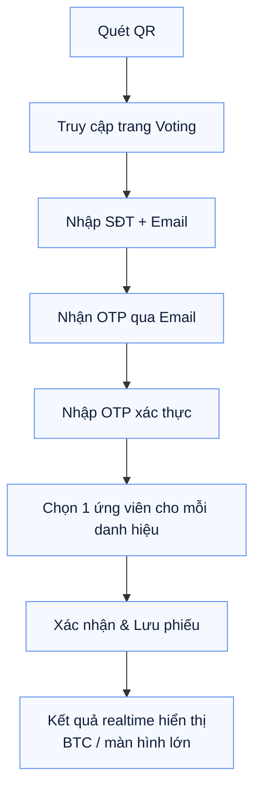
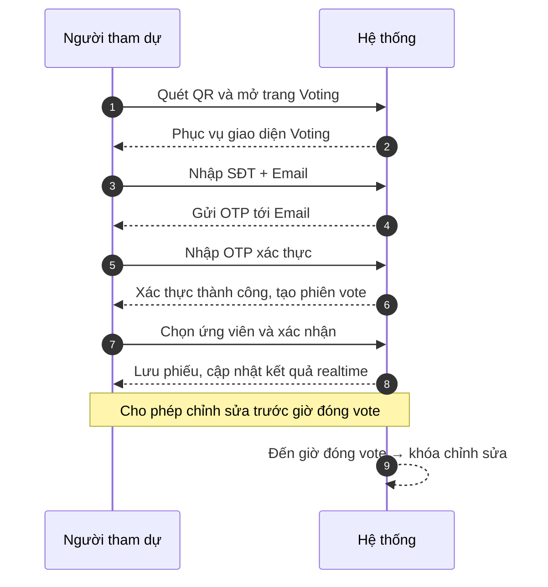

# MÔ TẢ HỆ THỐNG VOTE CHO SỰ KIỆN

## MÔ TẢ HỆ THỐNG VOTE CHO SỰ KIỆN

---

### 1) Mục đích

Phần mềm giúp người tham dự sự kiện bình chọn cho các danh hiệu (ví dụ: **King & Queen of the Night**) một cách đơn giản, minh bạch và chính xác, đảm bảo mỗi người chỉ được vote 1 lần cho mỗi danh hiệu.

---

### 2) Quy trình vận hành

1. Truy cập hệ thống
    - Khu vực sự kiện có băng rôn chứa mã QR.
    - Người tham dự quét QR để mở trang web voting trên điện thoại.
2. Xác thực người tham dự
    - Sau khi truy cập, người tham dự nhập Số điện thoại và Email.
    - Hệ thống gửi mã OTP tới email vừa nhập.
    - Người tham dự nhập OTP để xác nhận danh tính và được phép bắt đầu vote.
    - Cơ chế này đảm bảo mỗi người chỉ có thể vote 1 lần cho mỗi danh hiệu.
3. Thực hiện bình chọn
    - Giao diện hiển thị danh sách danh hiệu và ứng viên tương ứng.
    - Mỗi người chọn 1 ứng viên duy nhất cho mỗi danh hiệu, sau đó xác nhận và lưu phiếu.
4. Sửa phiếu (nếu cần)
    - Cho phép chỉnh sửa phiếu đã gửi trước thời điểm đóng vote (thời gian do admin cấu hình).
    - Sau thời điểm đóng vote, hệ thống tự động khóa và không cho phép chỉnh sửa.
5. Xem kết quả
    - Có trang hiển thị kết quả realtime, cập nhật tức thời theo số lượng phiếu hợp lệ.
    - Có thể chiếu lên màn hình lớn hoặc hiển thị riêng cho ban tổ chức.

---

### 2.1) Sơ đồ quy trình

### 2.2) Người tham dự vs Hệ thống

---

---

### 3) Bảo mật và chống gian lận

- Xác thực OTP qua email kết hợp lưu vết theo email và dấu thời gian.
- Chặn trùng lặp: Kiểm tra trạng thái đã vote cho từng danh hiệu theo email xác thực.
- Giới hạn thao tác: Khóa chỉnh sửa sau thời điểm đóng vote.

---

### 4) Phạm vi và giả định triển khai

- Phạm vi: 1 trang web voting cho sự kiện, danh sách danh hiệu và ứng viên do ban tổ chức cung cấp trước.
- Giả định:
    - Có kết nối Internet ổn định tại địa điểm sự kiện cho khách và màn hình trình chiếu.
    - Ban tổ chức cung cấp danh sách danh hiệu, ứng viên, và thời gian đóng vote trước ngày diễn ra.

---