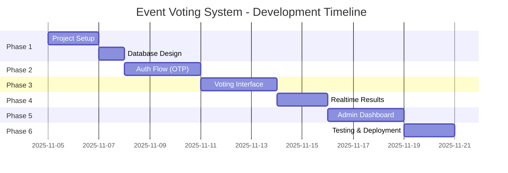

# KẾ HOẠCH TRIỂN KHAI CHI TIẾT - EVENT VOTING SYSTEM

> **Tài liệu tham chiếu chính** cho toàn bộ quá trình phát triển dự án

---

## 📋 MỤC LỤC

1. [Tổng quan dự án](#1-tổng-quan-dự-án)
2. [Timeline & Milestones](#2-timeline--milestones)
3. [Chi tiết từng Phase](#3-chi-tiết-từng-phase)
4. [Checklist hoàn thành](#4-checklist-hoàn-thành)

---

## 1. TỔNG QUAN DỰ ÁN

### Mục tiêu
Xây dựng hệ thống voting cho sự kiện với các tính năng:
- ✅ Xác thực OTP qua email
- ✅ Mỗi người vote 1 lần/danh hiệu
- ✅ Realtime results
- ✅ Admin dashboard
- ✅ Mobile-responsive
- ✅ Khóa vote sau deadline

### Tech Stack
- **Frontend**: Next.js 14 (App Router) + TypeScript
- **Styling**: Tailwind CSS + shadcn/ui
- **Backend**: Supabase (PostgreSQL + Realtime + Auth + Storage)
- **Email**: Supabase Auth Email hoặc Resend
- **Deployment**: Vercel

### Tài liệu tham khảo
- [Tech Stack Details](./tech-stack.md)
- [Database Schema](./database-schema.md)
- [API Specification](./api-specification.md)
- [UI Components](./ui-components.md)
- [Deployment Guide](./deployment-guide.md)

---

## 2. TIMELINE & MILESTONES



### Milestones
- **Week 1 (Day 1-3)**: Foundation ready ✅ Database schema deployed
- **Week 2 (Day 4-8)**: Core features ✅ Auth + Voting working
- **Week 3 (Day 9-12)**: Advanced features ✅ Realtime + Admin
- **Week 3+ (Day 13-15)**: Launch ready ✅ Tested + Deployed

---

## 3. CHI TIẾT TỪNG PHASE

### 📦 PHASE 1: PROJECT SETUP (Day 1-3)

#### 1.1. Initialize Next.js Project
```bash
# Commands to run
npx create-next-app@latest event-voting \
  --typescript \
  --tailwind \
  --app \
  --no-src-dir \
  --import-alias "@/*"

cd event-voting
```

#### 1.2. Install Core Dependencies
```bash
# Supabase
npm install @supabase/supabase-js @supabase/ssr

# UI & Forms
npm install @radix-ui/react-slot class-variance-authority clsx tailwind-merge
npm install react-hook-form @hookform/resolvers zod

# Utils
npm install date-fns lucide-react sonner
npm install qrcode.react @types/qrcode.react

# Dev dependencies
npm install -D @types/node
```

#### 1.3. Setup shadcn/ui
```bash
npx shadcn-ui@latest init

# Add required components
npx shadcn-ui@latest add button
npx shadcn-ui@latest add card
npx shadcn-ui@latest add input
npx shadcn-ui@latest add label
npx shadcn-ui@latest add form
npx shadcn-ui@latest add select
npx shadcn-ui@latest add dialog
npx shadcn-ui@latest add toast
npx shadcn-ui@latest add dropdown-menu
npx shadcn-ui@latest add avatar
npx shadcn-ui@latest add badge
npx shadcn-ui@latest add table
npx shadcn-ui@latest add radio-group
npx shadcn-ui@latest add separator
```

#### 1.4. Create Folder Structure
```
event-voting/
├── app/
│   ├── (auth)/
│   │   ├── auth/
│   │   │   ├── page.tsx
│   │   │   └── verify/page.tsx
│   │   └── layout.tsx
│   ├── (voting)/
│   │   ├── vote/
│   │   │   ├── page.tsx
│   │   │   └── success/page.tsx
│   │   ├── results/page.tsx
│   │   └── layout.tsx
│   ├── admin/
│   │   ├── layout.tsx
│   │   ├── page.tsx
│   │   ├── events/page.tsx
│   │   ├── categories/page.tsx
│   │   └── candidates/page.tsx
│   ├── api/
│   │   ├── auth/
│   │   │   ├── send-otp/route.ts
│   │   │   └── verify-otp/route.ts
│   │   └── votes/
│   │       └── route.ts
│   ├── layout.tsx
│   └── page.tsx
├── components/
│   ├── ui/              # shadcn components
│   ├── auth/
│   │   ├── LoginForm.tsx
│   │   └── OTPForm.tsx
│   ├── voting/
│   │   ├── CategoryCard.tsx
│   │   ├── CandidateCard.tsx
│   │   └── VotingForm.tsx
│   ├── results/
│   │   ├── ResultsChart.tsx
│   │   ├── RealtimeCounter.tsx
│   │   └── CategoryResults.tsx
│   └── admin/
│       ├── EventForm.tsx
│       ├── CategoryForm.tsx
│       └── CandidateForm.tsx
├── lib/
│   ├── supabase/
│   │   ├── client.ts
│   │   ├── server.ts
│   │   └── middleware.ts
│   ├── utils.ts
│   ├── validations.ts
│   └── constants.ts
├── types/
│   ├── database.types.ts
│   └── index.ts
├── hooks/
│   ├── useAuth.ts
│   ├── useVoting.ts
│   └── useRealtime.ts
└── .env.local
```

#### 1.5. Setup Supabase Project
1. Tạo project mới tại [supabase.com](https://supabase.com)
2. Copy credentials vào `.env.local`:
```env
NEXT_PUBLIC_SUPABASE_URL=your-project-url
NEXT_PUBLIC_SUPABASE_ANON_KEY=your-anon-key
SUPABASE_SERVICE_ROLE_KEY=your-service-role-key
NEXT_PUBLIC_APP_URL=http://localhost:3000
```

3. Tạo database schema (xem [database-schema.md](./database-schema.md))
4. Generate TypeScript types:
```bash
npx supabase gen types typescript --project-id "your-project-id" > types/database.types.ts
```

#### 1.6. Setup Supabase Clients
**File: `lib/supabase/client.ts`** (Client-side)
```typescript
import { createBrowserClient } from '@supabase/ssr'
import { Database } from '@/types/database.types'

export function createClient() {
  return createBrowserClient<Database>(
    process.env.NEXT_PUBLIC_SUPABASE_URL!,
    process.env.NEXT_PUBLIC_SUPABASE_ANON_KEY!
  )
}
```

**File: `lib/supabase/server.ts`** (Server-side)
```typescript
import { createServerClient, type CookieOptions } from '@supabase/ssr'
import { cookies } from 'next/headers'
import { Database } from '@/types/database.types'

export function createClient() {
  const cookieStore = cookies()

  return createServerClient<Database>(
    process.env.NEXT_PUBLIC_SUPABASE_URL!,
    process.env.NEXT_PUBLIC_SUPABASE_ANON_KEY!,
    {
      cookies: {
        get(name: string) {
          return cookieStore.get(name)?.value
        },
      },
    }
  )
}
```

#### ✅ Phase 1 Checklist
- [ ] Next.js project initialized
- [ ] All dependencies installed
- [ ] shadcn/ui configured
- [ ] Folder structure created
- [ ] Supabase project created
- [ ] Database schema deployed
- [ ] TypeScript types generated
- [ ] Supabase clients configured
- [ ] Environment variables set

---

### 🔐 PHASE 2: AUTHENTICATION FLOW (Day 4-6)

#### 2.1. Create Validation Schemas
**File: `lib/validations.ts`**
```typescript
import { z } from 'zod'

export const loginSchema = z.object({
  email: z.string().email('Email không hợp lệ'),
  phone: z.string().min(10, 'Số điện thoại không hợp lệ').max(11),
})

export const otpSchema = z.object({
  otp: z.string().length(6, 'OTP phải có 6 chữ số'),
})

export type LoginInput = z.infer<typeof loginSchema>
export type OTPInput = z.infer<typeof otpSchema>
```

#### 2.2. API Route: Send OTP
**File: `app/api/auth/send-otp/route.ts`**
```typescript
import { NextRequest, NextResponse } from 'next/server'
import { createClient } from '@/lib/supabase/server'
import { loginSchema } from '@/lib/validations'

export async function POST(request: NextRequest) {
  try {
    const body = await request.json()
    const { email, phone } = loginSchema.parse(body)

    const supabase = createClient()

    // Generate 6-digit OTP
    const otp = Math.floor(100000 + Math.random() * 900000).toString()
    const expiresAt = new Date(Date.now() + 10 * 60 * 1000) // 10 minutes

    // Store OTP in database
    const { error: insertError } = await supabase
      .from('otp_verifications')
      .insert({
        email,
        otp_code: otp,
        expires_at: expiresAt.toISOString(),
        verified: false,
      })

    if (insertError) throw insertError

    // Send OTP via email (Supabase Auth)
    // TODO: Implement email sending logic

    return NextResponse.json({ success: true })
  } catch (error) {
    return NextResponse.json(
      { error: 'Failed to send OTP' },
      { status: 500 }
    )
  }
}
```

#### 2.3. API Route: Verify OTP
**File: `app/api/auth/verify-otp/route.ts`**
```typescript
import { NextRequest, NextResponse } from 'next/server'
import { createClient } from '@/lib/supabase/server'
import { cookies } from 'next/headers'

export async function POST(request: NextRequest) {
  try {
    const { email, otp } = await request.json()
    const supabase = createClient()

    // Verify OTP
    const { data: otpRecord, error } = await supabase
      .from('otp_verifications')
      .select('*')
      .eq('email', email)
      .eq('otp_code', otp)
      .eq('verified', false)
      .gt('expires_at', new Date().toISOString())
      .single()

    if (error || !otpRecord) {
      return NextResponse.json(
        { error: 'OTP không hợp lệ hoặc đã hết hạn' },
        { status: 400 }
      )
    }

    // Mark OTP as verified
    await supabase
      .from('otp_verifications')
      .update({ verified: true })
      .eq('id', otpRecord.id)

    // Create or get voter record
    const { data: voter, error: voterError } = await supabase
      .from('voters')
      .upsert(
        { email, verified_at: new Date().toISOString() },
        { onConflict: 'email' }
      )
      .select()
      .single()

    if (voterError) throw voterError

    // Set session cookie
    cookies().set('voter_id', voter.id, {
      httpOnly: true,
      secure: process.env.NODE_ENV === 'production',
      maxAge: 60 * 60 * 24, // 24 hours
    })

    return NextResponse.json({ success: true, voter })
  } catch (error) {
    return NextResponse.json(
      { error: 'Verification failed' },
      { status: 500 }
    )
  }
}
```

#### 2.4. Login Page
**File: `app/(auth)/auth/page.tsx`**
```typescript
'use client'

import { useState } from 'react'
import { useRouter } from 'next/navigation'
import { useForm } from 'react-hook-form'
import { zodResolver } from '@hookform/resolvers/zod'
import { loginSchema, LoginInput } from '@/lib/validations'
import { Button } from '@/components/ui/button'
import { Input } from '@/components/ui/input'
import { toast } from 'sonner'

export default function LoginPage() {
  const router = useRouter()
  const [isLoading, setIsLoading] = useState(false)

  const form = useForm<LoginInput>({
    resolver: zodResolver(loginSchema),
  })

  async function onSubmit(data: LoginInput) {
    setIsLoading(true)
    try {
      const response = await fetch('/api/auth/send-otp', {
        method: 'POST',
        headers: { 'Content-Type': 'application/json' },
        body: JSON.stringify(data),
      })

      if (!response.ok) throw new Error('Failed to send OTP')

      // Store email in sessionStorage for verify page
      sessionStorage.setItem('voter_email', data.email)

      toast.success('OTP đã được gửi đến email của bạn')
      router.push('/auth/verify')
    } catch (error) {
      toast.error('Có lỗi xảy ra, vui lòng thử lại')
    } finally {
      setIsLoading(false)
    }
  }

  return (
    <div className="container max-w-md mx-auto py-20">
      <h1 className="text-3xl font-bold mb-8">Đăng nhập để bình chọn</h1>
      <form onSubmit={form.handleSubmit(onSubmit)} className="space-y-4">
        {/* Form implementation */}
      </form>
    </div>
  )
}
```

#### 2.5. OTP Verification Page
**File: `app/(auth)/auth/verify/page.tsx`**
```typescript
// Similar structure with OTP input
// Call /api/auth/verify-otp
// Redirect to /vote on success
```

#### ✅ Phase 2 Checklist
- [ ] Validation schemas created
- [ ] Send OTP API route implemented
- [ ] Verify OTP API route implemented
- [ ] Login page built
- [ ] OTP verification page built
- [ ] Email sending configured
- [ ] Session management working
- [ ] Error handling implemented

---

### 🗳️ PHASE 3: VOTING INTERFACE (Day 7-9)

#### 3.1. Fetch Voting Data
**File: `app/(voting)/vote/page.tsx`**
```typescript
import { createClient } from '@/lib/supabase/server'
import { cookies } from 'next/headers'
import { redirect } from 'next/navigation'
import VotingForm from '@/components/voting/VotingForm'

export default async function VotePage() {
  const supabase = createClient()
  const voterId = cookies().get('voter_id')?.value

  if (!voterId) redirect('/auth')

  // Fetch active event with categories and candidates
  const { data: event } = await supabase
    .from('events')
    .select(`
      *,
      categories (
        *,
        candidates (*)
      )
    `)
    .eq('is_active', true)
    .single()

  if (!event) return <div>Không có sự kiện đang diễn ra</div>

  // Check if voting is closed
  const votingClosed = new Date() > new Date(event.voting_close_time)

  // Fetch existing votes
  const { data: existingVotes } = await supabase
    .from('votes')
    .select('category_id, candidate_id')
    .eq('voter_id', voterId)

  return (
    <div className="container py-10">
      <h1 className="text-4xl font-bold mb-2">{event.name}</h1>
      <p className="text-muted-foreground mb-8">{event.description}</p>

      {votingClosed ? (
        <div className="text-center py-20">
          <p className="text-xl">Thời gian bình chọn đã kết thúc</p>
        </div>
      ) : (
        <VotingForm
          categories={event.categories}
          existingVotes={existingVotes || []}
          voterId={voterId}
        />
      )}
    </div>
  )
}
```

#### 3.2. Voting Form Component
**File: `components/voting/VotingForm.tsx`**
```typescript
'use client'

import { useState } from 'react'
import { useRouter } from 'next/navigation'
import { Button } from '@/components/ui/button'
import CategoryCard from './CategoryCard'
import { toast } from 'sonner'

interface VotingFormProps {
  categories: any[]
  existingVotes: any[]
  voterId: string
}

export default function VotingForm({ categories, existingVotes, voterId }: VotingFormProps) {
  const router = useRouter()
  const [selections, setSelections] = useState<Record<string, string>>(() => {
    // Initialize with existing votes
    const initial: Record<string, string> = {}
    existingVotes.forEach(vote => {
      initial[vote.category_id] = vote.candidate_id
    })
    return initial
  })
  const [isSubmitting, setIsSubmitting] = useState(false)

  async function handleSubmit() {
    setIsSubmitting(true)
    try {
      const votes = Object.entries(selections).map(([categoryId, candidateId]) => ({
        voter_id: voterId,
        category_id: categoryId,
        candidate_id: candidateId,
      }))

      const response = await fetch('/api/votes', {
        method: 'POST',
        headers: { 'Content-Type': 'application/json' },
        body: JSON.stringify({ votes }),
      })

      if (!response.ok) throw new Error('Failed to submit votes')

      toast.success('Phiếu bầu của bạn đã được ghi nhận!')
      router.push('/vote/success')
    } catch (error) {
      toast.error('Có lỗi xảy ra, vui lòng thử lại')
    } finally {
      setIsSubmitting(false)
    }
  }

  return (
    <div className="space-y-12">
      {categories.map(category => (
        <CategoryCard
          key={category.id}
          category={category}
          selectedCandidate={selections[category.id]}
          onSelect={(candidateId) =>
            setSelections(prev => ({ ...prev, [category.id]: candidateId }))
          }
        />
      ))}

      <div className="flex justify-center">
        <Button
          size="lg"
          onClick={handleSubmit}
          disabled={isSubmitting || Object.keys(selections).length !== categories.length}
        >
          {isSubmitting ? 'Đang gửi...' : 'Xác nhận bình chọn'}
        </Button>
      </div>
    </div>
  )
}
```

#### 3.3. Category & Candidate Cards
**File: `components/voting/CategoryCard.tsx`**
```typescript
import { Card } from '@/components/ui/card'
import { RadioGroup, RadioGroupItem } from '@/components/ui/radio-group'
import { Label } from '@/components/ui/label'
import { Avatar, AvatarImage, AvatarFallback } from '@/components/ui/avatar'

// Implementation with candidate selection
```

#### 3.4. Submit Votes API
**File: `app/api/votes/route.ts`**
```typescript
import { NextRequest, NextResponse } from 'next/server'
import { createClient } from '@/lib/supabase/server'

export async function POST(request: NextRequest) {
  try {
    const { votes } = await request.json()
    const supabase = createClient()

    // Upsert votes (insert or update)
    const { error } = await supabase
      .from('votes')
      .upsert(votes, {
        onConflict: 'voter_id,category_id',
      })

    if (error) throw error

    return NextResponse.json({ success: true })
  } catch (error) {
    return NextResponse.json(
      { error: 'Failed to submit votes' },
      { status: 500 }
    )
  }
}
```

#### ✅ Phase 3 Checklist
- [ ] Vote page with data fetching
- [ ] VotingForm component
- [ ] CategoryCard component
- [ ] CandidateCard component
- [ ] Submit votes API
- [ ] Success page
- [ ] Voting deadline check
- [ ] Edit vote functionality

---

### 📊 PHASE 4: REALTIME RESULTS (Day 10-11)

#### 4.1. Results Page with Realtime
**File: `app/results/page.tsx`**
```typescript
'use client'

import { useEffect, useState } from 'react'
import { createClient } from '@/lib/supabase/client'
import { Card } from '@/components/ui/card'
import { Badge } from '@/components/ui/badge'
import { Avatar, AvatarImage } from '@/components/ui/avatar'

export default function ResultsPage() {
  const [results, setResults] = useState<any[]>([])
  const supabase = createClient()

  useEffect(() => {
    // Initial fetch
    fetchResults()

    // Subscribe to realtime changes
    const channel = supabase
      .channel('votes-changes')
      .on(
        'postgres_changes',
        { event: '*', schema: 'public', table: 'votes' },
        () => {
          fetchResults()
        }
      )
      .subscribe()

    return () => {
      channel.unsubscribe()
    }
  }, [])

  async function fetchResults() {
    const { data } = await supabase
      .from('vote_results_view') // Create a view in Supabase
      .select('*')
      .order('category_order')
      .order('vote_count', { ascending: false })

    if (data) setResults(data)
  }

  return (
    <div className="container py-10">
      <h1 className="text-4xl font-bold mb-10">Kết quả bình chọn</h1>

      {/* Render results by category */}
      {/* Live update indicator */}
    </div>
  )
}
```

#### 4.2. Create Database View for Results
```sql
CREATE OR REPLACE VIEW vote_results_view AS
SELECT
  c.id as category_id,
  c.name as category_name,
  c.order as category_order,
  ca.id as candidate_id,
  ca.name as candidate_name,
  ca.photo_url,
  COUNT(v.id) as vote_count
FROM categories c
JOIN candidates ca ON ca.category_id = c.id
LEFT JOIN votes v ON v.candidate_id = ca.id
GROUP BY c.id, c.name, c.order, ca.id, ca.name, ca.photo_url
ORDER BY c.order, vote_count DESC;
```

#### ✅ Phase 4 Checklist
- [ ] Results page created
- [ ] Realtime subscription working
- [ ] Database view for aggregated results
- [ ] Live update indicator
- [ ] Results visualization (charts/cards)
- [ ] Category-wise results display

---

### 👨‍💼 PHASE 5: ADMIN DASHBOARD (Day 12-14)

#### 5.1. Admin Authentication Middleware
**File: `middleware.ts`**
```typescript
import { NextResponse } from 'next/server'
import type { NextRequest } from 'next/server'

export function middleware(request: NextRequest) {
  if (request.nextUrl.pathname.startsWith('/admin')) {
    // Check admin auth
    const adminToken = request.cookies.get('admin_token')

    if (!adminToken) {
      return NextResponse.redirect(new URL('/admin/login', request.url))
    }
  }

  return NextResponse.next()
}

export const config = {
  matcher: '/admin/:path*',
}
```

#### 5.2. Admin Dashboard Pages
- Events management (CRUD)
- Categories management (CRUD)
- Candidates management (CRUD with image upload)
- Results analytics
- Voter list

#### 5.3. Image Upload to Supabase Storage
```typescript
async function uploadCandidatePhoto(file: File) {
  const supabase = createClient()
  const fileName = `${Date.now()}-${file.name}`

  const { data, error } = await supabase.storage
    .from('candidate-photos')
    .upload(fileName, file)

  if (error) throw error

  const { data: { publicUrl } } = supabase.storage
    .from('candidate-photos')
    .getPublicUrl(fileName)

  return publicUrl
}
```

#### ✅ Phase 5 Checklist
- [ ] Admin authentication
- [ ] Events CRUD
- [ ] Categories CRUD
- [ ] Candidates CRUD
- [ ] Image upload to Storage
- [ ] Results analytics page
- [ ] Voter management

---

### 🚀 PHASE 6: TESTING & DEPLOYMENT (Day 15-16)

#### 6.1. Testing Checklist
- [ ] Test OTP flow (send + verify)
- [ ] Test duplicate vote prevention
- [ ] Test vote editing before deadline
- [ ] Test voting lock after deadline
- [ ] Test realtime updates with multiple devices
- [ ] Test mobile responsiveness
- [ ] Test image uploads
- [ ] Test admin CRUD operations

#### 6.2. Deploy to Vercel
```bash
# Install Vercel CLI
npm i -g vercel

# Deploy
vercel deploy --prod

# Set environment variables in Vercel dashboard
```

#### 6.3. Generate QR Code
```typescript
import QRCode from 'qrcode.react'

<QRCode
  value="https://your-domain.vercel.app"
  size={256}
  level="H"
  includeMargin={true}
/>
```

#### 6.4. Final Optimizations
- [ ] Add loading states
- [ ] Add error boundaries
- [ ] Optimize images
- [ ] Add SEO meta tags
- [ ] Add analytics (optional)

#### ✅ Phase 6 Checklist
- [ ] All features tested
- [ ] Mobile responsive confirmed
- [ ] Deployed to production
- [ ] QR code generated
- [ ] Performance optimized
- [ ] Documentation updated

---

## 4. CHECKLIST HOÀN THÀNH TOÀN BỘ DỰ ÁN

### Foundation ✅
- [ ] Next.js project setup
- [ ] Supabase project configured
- [ ] Database schema deployed
- [ ] TypeScript types generated
- [ ] UI library (shadcn) installed

### Features ✅
- [ ] OTP authentication working
- [ ] Voting interface complete
- [ ] Realtime results working
- [ ] Admin dashboard functional
- [ ] Image upload working

### Quality ✅
- [ ] Mobile responsive
- [ ] Error handling
- [ ] Loading states
- [ ] Security (RLS policies)
- [ ] Rate limiting

### Deployment ✅
- [ ] Deployed to production
- [ ] Environment variables set
- [ ] QR code ready
- [ ] Performance optimized
- [ ] Documentation complete

---

## 📚 NEXT STEPS

Sau khi hoàn thành implementation plan này, tham khảo:
1. **[tech-stack.md](./tech-stack.md)** - Chi tiết về công nghệ
2. **[database-schema.md](./database-schema.md)** - SQL scripts đầy đủ
3. **[api-specification.md](./api-specification.md)** - API endpoints chi tiết
4. **[ui-components.md](./ui-components.md)** - Component specifications
5. **[deployment-guide.md](./deployment-guide.md)** - Hướng dẫn deploy

---

**Last updated**: 2025-11-05
**Status**: Ready for implementation ✅
