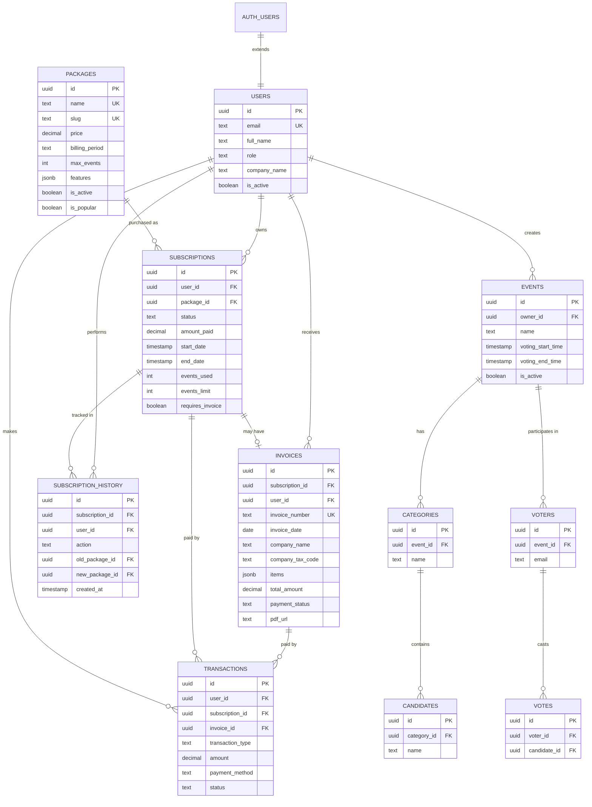

# 🗂️ Database ERD - Subscription System

## Entity Relationship Diagram



---

## 🔗 Key Relationships

### **1. User → Subscription → Package**
```
User purchases Package → Creates Subscription
Subscription.package_id → References Package
Subscription.user_id → References User
```

### **2. Subscription → Invoice**
```
When requires_invoice = true:
  Subscription creates Invoice
  Invoice.subscription_id → References Subscription
```

### **3. Payment Flow**
```
User → Transaction (payment) → Subscription (status: active)
Transaction.subscription_id → References Subscription
Transaction.invoice_id → References Invoice (if exists)
```

### **4. Subscription Limits → Event Creation**
```
Before creating Event:
  Check can_user_create_event(user_id)
    → Gets active Subscription
    → Checks events_used < events_limit
    → Returns true/false
```

---

## 📊 Table Statistics

| Table | Estimated Rows | Growth Rate | Indexes |
|-------|----------------|-------------|---------|
| users | 1,000 - 10,000 | Low | 3 |
| packages | 5 - 20 | None | 2 |
| subscriptions | 1,000 - 100,000 | Medium | 4 |
| invoices | 500 - 50,000 | Medium | 5 |
| transactions | 2,000 - 200,000 | High | 4 |
| subscription_history | 5,000 - 500,000 | High | 3 |

---

## 🔐 Access Control Matrix

| Resource | Public | User (Self) | Admin | Super Admin |
|----------|--------|-------------|-------|-------------|
| **Packages** | ✅ Read (active) | ✅ Read | ✅ CRUD | ✅ CRUD |
| **Users** | ❌ | ✅ Read/Update | ✅ Read | ✅ CRUD |
| **Subscriptions** | ❌ | ✅ Read/Create | ✅ Read/Update | ✅ CRUD |
| **Invoices** | ❌ | ✅ Read (own) | ✅ Read/Update | ✅ CRUD |
| **Transactions** | ❌ | ✅ Read (own) | ✅ Read | ✅ CRUD |
| **History** | ❌ | ✅ Read (own) | ✅ Read | ✅ Read |

---

## 🔄 Data Flow Diagrams

### **Purchase Flow:**
```
┌──────┐         ┌────────────┐         ┌──────────┐
│ User │────────▶│ Select     │────────▶│ Payment  │
└──────┘         │ Package    │         │ Gateway  │
                 └────────────┘         └──────────┘
                       │                      │
                       ▼                      ▼
                 ┌────────────┐         ┌──────────┐
                 │ Create     │◀────────│ Callback │
                 │ Subscription│         │ Verified │
                 └────────────┘         └──────────┘
                       │
                       ▼
                 ┌────────────┐
                 │ Generate   │
                 │ Invoice?   │
                 └────────────┘
                       │
              ┌────────┴────────┐
              ▼                 ▼
         ┌────────┐       ┌──────────┐
         │ Yes:   │       │ No:      │
         │ Create │       │ Complete │
         │ Invoice│       └──────────┘
         └────────┘
              │
              ▼
         ┌──────────┐
         │ Generate │
         │ PDF      │
         └──────────┘
```

### **Event Creation Flow:**
```
┌──────┐         ┌────────────┐         ┌──────────┐
│ User │────────▶│ Click      │────────▶│ Check    │
└──────┘         │ "New Event"│         │ Limit    │
                 └────────────┘         └──────────┘
                                              │
                          ┌───────────────────┴────────────┐
                          ▼                                ▼
                    ┌──────────┐                    ┌──────────┐
                    │ Has      │                    │ No       │
                    │ Active   │                    │ Active   │
                    │ Sub?     │                    │ Sub      │
                    └──────────┘                    └──────────┘
                          │                                │
                          ▼                                ▼
                    ┌──────────┐                    ┌──────────┐
                    │ Within   │                    │ Show     │
                    │ Limit?   │                    │ Upgrade  │
                    └──────────┘                    │ Prompt   │
                          │                         └──────────┘
            ┌─────────────┴──────────┐
            ▼                        ▼
      ┌──────────┐            ┌──────────┐
      │ Yes:     │            │ No:      │
      │ Create   │            │ Show     │
      │ Event    │            │ Upgrade  │
      └──────────┘            │ Prompt   │
            │                 └──────────┘
            ▼
      ┌──────────┐
      │ Increment│
      │ events_  │
      │ used     │
      └──────────┘
```

---

## 🎯 Indexing Strategy

### **High Priority Indexes (Hot Queries):**
```sql
-- User lookups
CREATE INDEX idx_users_email ON users(email);
CREATE INDEX idx_users_role ON users(role);

-- Subscription queries
CREATE INDEX idx_subscriptions_user_id ON subscriptions(user_id);
CREATE INDEX idx_subscriptions_status ON subscriptions(status);
CREATE INDEX idx_subscriptions_end_date ON subscriptions(end_date);

-- Invoice searches
CREATE INDEX idx_invoices_user_id ON invoices(user_id);
CREATE INDEX idx_invoices_invoice_number ON invoices(invoice_number);
CREATE INDEX idx_invoices_payment_status ON invoices(payment_status);

-- Transaction history
CREATE INDEX idx_transactions_user_id ON transactions(user_id);
CREATE INDEX idx_transactions_created_at ON transactions(created_at DESC);
```

---

## 📈 Scaling Considerations

### **Current Capacity (Single DB):**
- **Users**: 100,000
- **Subscriptions**: 1,000,000
- **Transactions**: 10,000,000
- **Query Response**: < 100ms

### **Optimization Techniques:**
1. **Partitioning**: Partition `transactions` by date
2. **Archiving**: Archive old subscription_history (>2 years)
3. **Read Replicas**: Separate read/write operations
4. **Caching**: Cache active subscriptions in Redis
5. **Materialized Views**: Pre-compute common aggregates

---

## 🔄 Migration Path

### **From Current System:**
```sql
-- Add owner_id to events table
ALTER TABLE events ADD COLUMN owner_id UUID REFERENCES users(id);

-- Migrate existing events to default user
UPDATE events SET owner_id = (
    SELECT id FROM users WHERE role = 'super_admin' LIMIT 1
) WHERE owner_id IS NULL;

-- Make it required
ALTER TABLE events ALTER COLUMN owner_id SET NOT NULL;
```

---

## 📝 Naming Conventions

- **Tables**: snake_case, plural (`subscriptions`, `invoices`)
- **Columns**: snake_case (`company_tax_code`, `payment_status`)
- **Indexes**: `idx_<table>_<column>` (`idx_users_email`)
- **Foreign Keys**: `<table>_id` (`user_id`, `package_id`)
- **Enums**: lowercase with underscore (`one_time`, `super_admin`)
- **Functions**: snake_case verbs (`generate_invoice_number`)

---

## 🧪 Sample Queries

### **Get user's active subscription with package:**
```sql
SELECT
    s.*,
    p.name as package_name,
    p.features,
    s.events_limit - s.events_used as events_remaining
FROM subscriptions s
JOIN packages p ON p.id = s.package_id
WHERE s.user_id = 'user-uuid'
AND s.status = 'active'
AND (s.end_date IS NULL OR s.end_date > NOW());
```

### **Revenue by package (last 30 days):**
```sql
SELECT
    p.name,
    COUNT(s.id) as subscriptions_count,
    SUM(s.amount_paid) as total_revenue
FROM subscriptions s
JOIN packages p ON p.id = s.package_id
WHERE s.created_at >= NOW() - INTERVAL '30 days'
GROUP BY p.name
ORDER BY total_revenue DESC;
```

### **Unpaid invoices:**
```sql
SELECT
    i.*,
    u.email,
    u.full_name
FROM invoices i
JOIN users u ON u.id = i.user_id
WHERE i.payment_status = 'unpaid'
AND i.due_date < NOW()
ORDER BY i.due_date ASC;
```

---

## 🎉 Done!
Database schema, ERD, and documentation complete!
Ready for implementation. 🚀
